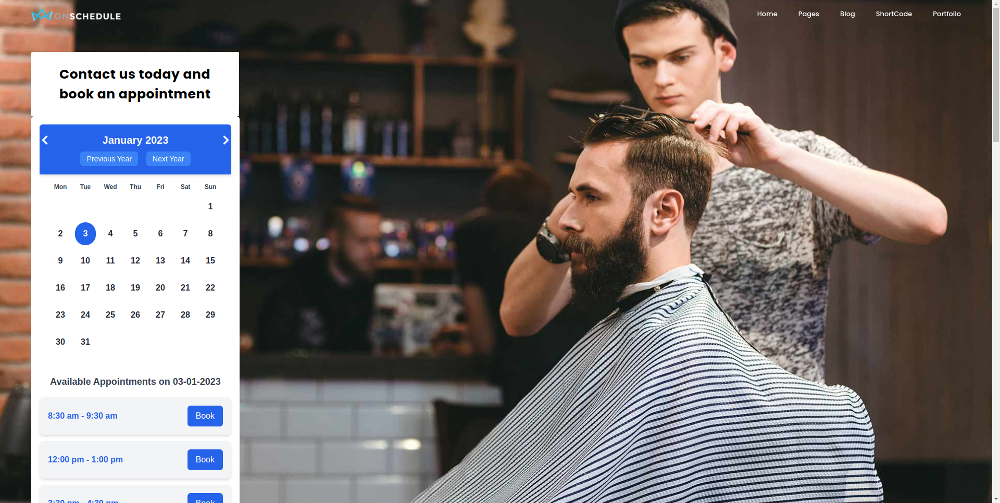
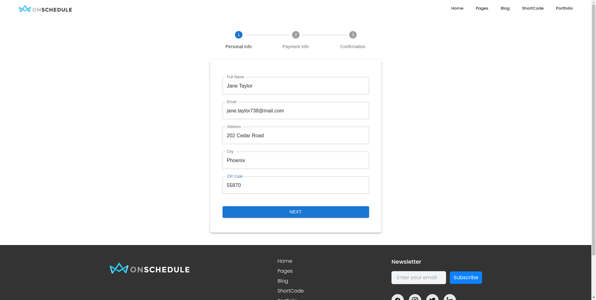
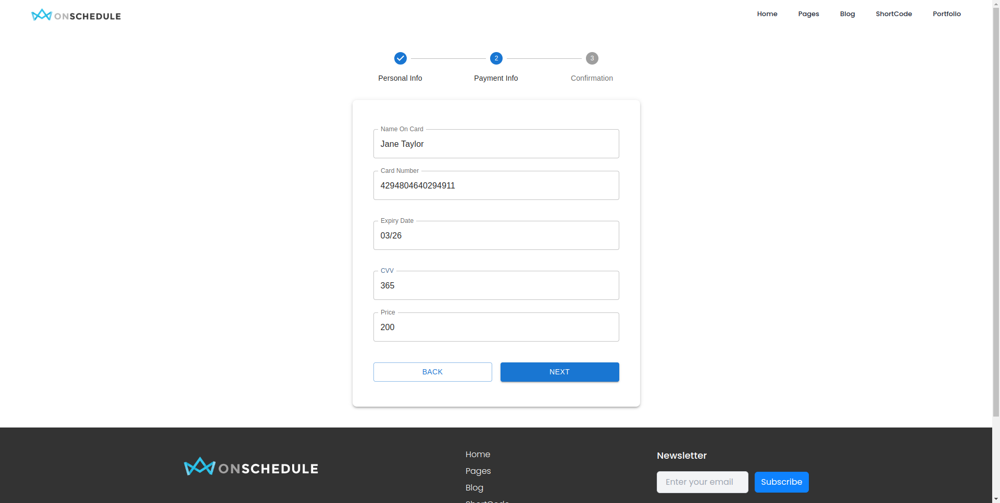
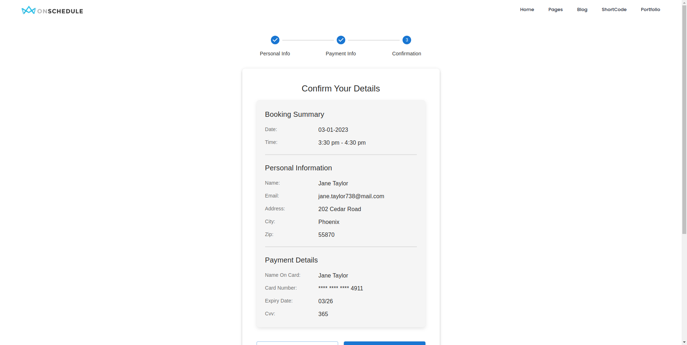

# **xon_schedule - Barber Appointment Booking System**

xon_schedule is a fully functional **Barber Appointment Booking System** designed for seamless appointment scheduling. The application features static offline functionality, a responsive design, and comprehensive booking management.

---

## **Table of Contents**
- [**xon_schedule - Barber Appointment Booking System**](#xon_schedule---barber-appointment-booking-system)
  - [**Table of Contents**](#table-of-contents)
  - [**UI Screenshots**](#ui-screenshots)
    - [Home Page](#home-page)
    - [Checkout Page](#checkout-page)
    - [Payment Form](#payment-form)
    - [Confirmation Page](#confirmation-page)
  - [**Overview**](#overview)
  - [**Features**](#features)
  - [**Tech Stack**](#tech-stack)
  - [**Project Setup and Installation**](#project-setup-and-installation)
    - [**Prerequisites**](#prerequisites)
    - [**Steps to Run Locally**](#steps-to-run-locally)
  - [**Working with Docker**](#working-with-docker)
  - [**Data**](#data)
    - [**Frozen Date and Expiry Date**](#frozen-date-and-expiry-date)
    - [**window.currentBookingInfo**](#windowcurrentbookinginfo)
    - [**window.bookingResults**](#windowbookingresults)
  - [**Run Prompt Generation Script**](#run-prompt-generation-script)
    - [**Setting Up a Virtual Environment**](#setting-up-a-virtual-environment)
    - [**Generate Appointment Prompts**](#generate-appointment-prompts)
      - [**Example Generated Result**](#example-generated-result)
  - [**Usage**](#usage)
  - [**Deployment**](#deployment)
  - [**Testing**](#testing)

---

## **UI Screenshots**

### Home Page


### Checkout Page


### Payment Form


### Confirmation Page


---

## **Overview**

xon_schedule enables users to:
- Schedule barber appointments by selecting dates and times.
- Provide payment and personal details for confirmation.
- Manage booking data offline using local storage.

---

## **Features**

- **Static Offline Functionality**: The app functions offline after being built.
- **Appointment Booking**: Users can browse and book barber appointments dynamically.
- **Global State Management**: Utilizes the `window` object for temporary state persistence.
- **Data Persistence**: Stores user data and booking history in `localStorage` for session continuity.
- **Responsive Design**: Fully responsive across devices.
- **Prompt Generator**: Dynamically generates realistic booking scenarios for testing.

---

## **Tech Stack**

- **Frontend**: React.js
- **State Management**: Local Storage APIs
- **Styling**: Tailwind CSS
- **Backend Simulation**: JSON data

---

## **Project Setup and Installation**

### **Prerequisites**

Ensure you have the following installed:

- **Node.js** (v16 or above)
- **npm** (comes with Node.js) or **yarn**
- **Docker**: [Install Docker](https://www.docker.com/get-started)

### **Steps to Run Locally**

1. **Clone the Repository**:
   ```bash
   git clone https://github.com/tr-zrafiq/xon_schedule.git
   cd xon_schedule
   ```
2. **Install Dependencies**:
   ```bash
   npm install
   ```
3. **Run the Application**:
   ```bash
   npm start
   ```
4. **Access the Application**:
   Open your browser and navigate to [http://localhost:3000](http://localhost:3000).

---

## **Working with Docker**

1. **Build the Docker Image**:
   ```bash
   docker buildx build --platform=linux/amd64 -f ./Dockerfile -t xon_schedule . --load
   ```

2. **Run the Docker Container**:
   ```bash
   docker run -d -p 3000:80 xon_schedule
   ```

3. **Access the Application**:
   Open your browser and navigate to [http://localhost:3000](http://localhost:3000).

4. **Check the Running Container**:
   ```bash
   docker ps
   ```

5. **Stop the Container**:
   ```bash
   docker stop <container_id>
   ```

6. **Remove the Container**:
   ```bash
   docker rm <container_id>
   ```

---

## **Data**

### **Frozen Date and Expiry Date**

- The application is frozen in time to `01-01-2024`. Any selected date reflects this baseline for consistent testing and demonstration.
- The expiry date in payment is frozen to `01/24` by default.

### **window.currentBookingInfo**

Tracks active booking data dynamically. Example structure:

```json
{
            "userDetails": {
                "name": "Laura Jackson",
                "email": "laura.jackson318@test.com",
                "address": "202 Cedar Road",
                "city": "Phoenix",
                "zip": "79377"
            },
            "bookingDetails": {
                "selectedDate": "20-07-2023",
                "selectedTime": "4:00 pm - 5:00 pm",
                "serviceFee": 200
            },
            "paymentDetails": {
                "NameOnCard": "Laura Jackson",
                "cardNumber": "4886101073311463",
                "expiryDate": "08/25",
                "cvv": "467"
            },
            "isFinalPage":true
}
```

### **window.bookingResults**

Stores completed booking history for reference. Example structure:

```json
[

   {
      "userDetails": {
         "name": "Laura Jackson",
         "email": "laura.jackson318@test.com",
         "address": "202 Cedar Road",
         "city": "Phoenix",
         "zip": "79377"
            },
      "bookingDetails": {
         "selectedDate": "20-07-2023",
         "selectedTime": "4:00 pm - 5:00 pm",
         "serviceFee": 200
            },
      "paymentDetails": {
         "NameOnCard": "Laura Jackson",
         "cardNumber": "4886101073311463",
         "expiryDate": "08/25",
         "cvv": "467"
         }
   },
]
```

---

## **Run Prompt Generation Script**

### **Setting Up a Virtual Environment**

1. **Navigate to the Project Directory**:
   ```bash
   cd xon_schedule
   ```

2. **Create a Virtual Environment**:
   ```bash
   python -m venv venv
   ```

3. **Activate the Virtual Environment**:
   - **Windows**:
     ```bash
     venv\Scripts\activate
     ```
   - **macOS/Linux**:
     ```bash
     source venv/bin/activate
     ```

4. **Run the Script**:
   ```bash
   python generate_prompts.py -n 20 -o booking_prompts.json
   ```

5. **Deactivate the Virtual Environment**:
   ```bash
   deactivate
   ```

#### **Example Generated Result**

```json
    {
        "prompt": "Hi, I need an appointment on 11 February, 2029 at 8:00 am - 9:00 am. Please contact at olivia.jackson341@mail.com. Scheduled under Olivia Jackson, from Houston, currently staying at 101 Pine Drive, 84148. Payment processed via Olivia Jackson, card 0621320248651630, expires 04/30, CVV 947.",
        "bookingResults": {
            "userDetails": {
                "name": "Olivia Jackson",
                "email": "olivia.jackson341@mail.com",
                "address": "101 Pine Drive",
                "city": "Houston",
                "zip": "84148"
            },
            "bookingDetails": {
                "selectedDate": "11-02-2029",
                "selectedTime": "8:00 am - 9:00 am",
                "serviceFee": 200
            },
            "paymentDetails": {
                "NameOnCard": "Olivia Jackson",
                "cardNumber": "0621320248651630",
                "expiryDate": "04/30",
                "cvv": "947"
            }
        }
    }
```

---

## **Usage**

1. **Book an Appointment**:
   - Select a date and time for your appointment.
   - Enter your personal and payment details.
   - Confirm the booking to save it in `window.bookingResults`.

2. **Testing**:
   - Check `window.currentBookingInfo` for active booking details.
   - Inspect `window.bookingResults` for completed bookings.

---

## **Deployment**

Use Docker to deploy the application by following the steps outlined in the Docker section.

---

## **Testing**

Testing the application is recommended using manual browser testing.

